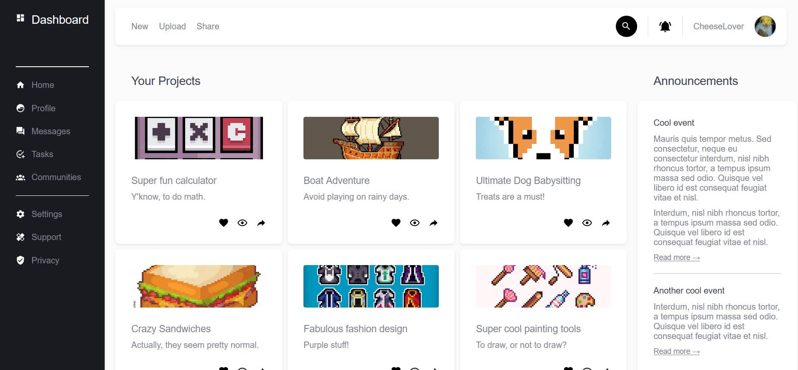

# PROJECT.admin-dashboard
Admin dashboard for the Odin project.

## Built with
- HTML
* CSS
+ JS

## Tools
- Visual Studio Code
- Git and GitHub

## Third party code
- Google Fonts
- Google Images

## Outcome
 - Improved usage of CSS Flex properties, specially object positioning while using images.
 - Additional password match validation with the use of JavaScript.
 
 ## Live preview [here](https://bonemuffin.github.io/PROJECT.admin-dashboard/index.html)

